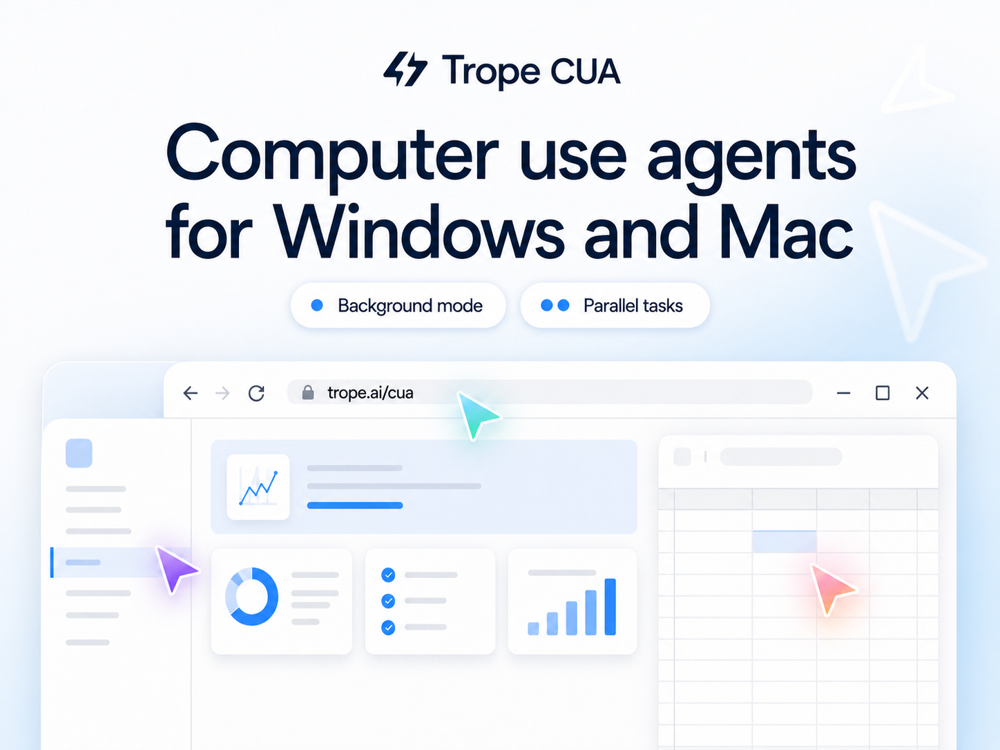

# Trope CUA

Background computer use for desktop agents on Windows and macOS.

Trope CUA lets an AI agent inspect and operate real desktop apps while avoiding accidental movement of your real mouse cursor or changes to your active app when the OS and target app support safe routes. It exposes screenshots, accessibility trees, action receipts, and trajectory recording over MCP, a daemon, or direct CLI calls.

The Windows implementation lives at the repository root. The macOS Swift implementation lives under [`native/macos/trope-cua`](native/macos/trope-cua).



## Install From Source

Binary release artifacts are not published yet. Clone the repository, or download a GitHub-generated source archive from the [releases page](https://github.com/voctory/trope-cua/releases), then run the installer script locally.

Windows requirements:

- Windows 10 1903+ or Windows 11.
- PowerShell.
- .NET SDK matching [`global.json`](global.json).

Install a self-contained Windows build:

```powershell
.\scripts\install-windows.ps1 -SelfContained
```

macOS requirements:

- macOS 14 or newer.
- Xcode Command Line Tools.
- Accessibility and Screen Recording permissions for `TropeCUA.app`.

Install a local macOS build:

```bash
./scripts/install-macos.sh
```

Verify the installed command on either platform:

```bash
trope-cua --help
trope-cua check_permissions
trope-cua list_windows
```

Register with an MCP client:

```powershell
trope-cua mcp-config
trope-cua mcp-config --client cursor
```

Or point any MCP client at:

```text
trope-cua mcp
```

## Safety Contract

Mutating actions return receipts. Treat an action as background-safe only when all three fields say:

```json
{
  "background_safe": true,
  "cursor_moved": false,
  "foreground_changed": false
}
```

`ok=true` means the requested route completed. It does not by itself mean the route preserved the user's foreground work. Unsafe routes and fallbacks are reported in the receipt instead of being hidden.

## Capabilities

- List desktop windows and apps.
- Snapshot a specific target window as pixels, accessibility tree, or both.
- Click, type, press keys, scroll, and set values through background-safe routes when the target exposes them.
- Run as an MCP stdio server, a long-running daemon, or direct CLI tool calls.
- Show a visual agent cursor overlay without moving the user's hardware cursor.
- Record and replay trajectories for debugging and regression work.
- Refuse known unsafe parent-session routes instead of pretending delivery succeeded.

## Known Limits

- Trope CUA is not a VM or sandbox. Same-session tools operate on the real user desktop.
- Not every app exposes a safe UIA/MSAA route.
- Chromium and Electron parallel work need separate profiles and CDP ports for true isolation.
- Games, DirectX, Unity, Unreal, raw-input surfaces, and many canvas-heavy apps need child-session or AppBroadcast-style isolation.
- Binary release artifacts are not published yet; install from source.

Read the full [known limits](docs/limits.md) before giving an agent authority over authenticated apps.

## First Loop

Use MCP or the daemon for workflows that act on `element_index` values from a snapshot. With the daemon, keep `serve` running in one terminal and call tools from another:

```powershell
trope-cua serve --instance demo
```

```powershell
trope-cua call --instance demo list_windows '{}'
trope-cua call --instance demo get_window_state '{"pid":1234,"window_id":456789}'
trope-cua call --instance demo click '{"pid":1234,"window_id":456789,"element_index":14}'
```

For the full workflow, see the [quickstart](docs/quickstart.md).

## Documentation

- [Installation](docs/installation.md)
- [Quickstart](docs/quickstart.md)
- [Workflows](docs/workflows.md)
- [Tools and command modes](docs/reference-tools.md)
- [Safety](SAFETY.md)
- [Privacy](PRIVACY.md)
- [Threat model](docs/threat-model.md)
- [Known limits](docs/limits.md)

## Development

Windows:

```powershell
dotnet build trope-cua.sln
.\scripts\build.ps1
dotnet format --verify-no-changes --no-restore --verbosity minimal
.\scripts\run-tests.ps1
```

macOS:

```bash
cd native/macos/trope-cua
swift build
./scripts/test.sh
./scripts/install-local.sh
```

macOS development and permission checks must run on macOS. Windows integration tests must run on Windows.

## License

Trope CUA is released under the MIT License. See [LICENSE](LICENSE) and [NOTICE](NOTICE).

## Trademarks

Apple, macOS, Microsoft, Windows, OpenAI, Anthropic, Claude, Cua, and other referenced names are trademarks or registered trademarks of their respective owners. This project is not affiliated with or endorsed by those companies or projects.
